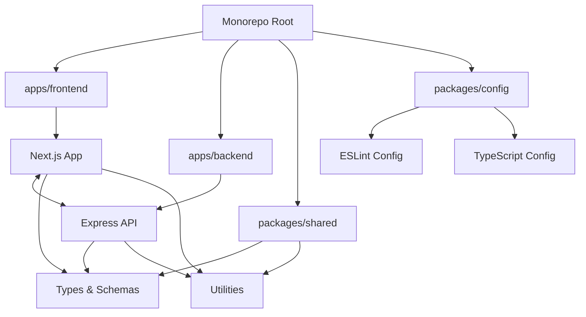
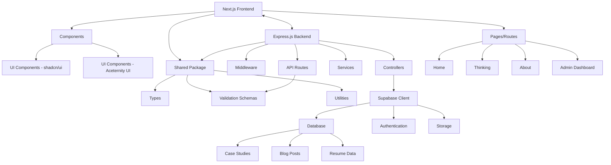

# Combined Personal Website Plan

## 1. Project Overview

This personal website will showcase your 10+ years of experience in product management and UX strategy, featuring three main sections:

1. **Home Page**: Professional introduction highlighting expertise in aligning product vision with business needs
2. **Thinking Page**: Masonry-style layout featuring detailed case studies and blog posts
3. **About Page**: Resume-style presentation with work experience, education, skills, and contact form

The project uses a monorepo structure with:
- **Frontend**: Next.js with shadcn/ui and Aceternity UI for a responsive, animated interface
- **Backend**: Express.js server with Zod validation, connecting to Supabase as the database
- **Shared Packages**: Common types, utilities, and validation schemas

## 2. Monorepo Architecture



## 3. Technical Architecture



## 4. Project Structure

```
personal-website-next/
├── package.json (root package.json)
├── turbo.json (Turborepo configuration)
├── apps/
│   ├── frontend/ (Next.js app)
│   │   ├── app/
│   │   ├── components/
│   │   ├── lib/
│   │   ├── hooks/
│   │   ├── public/
│   │   └── package.json
│   └── backend/ (Express.js app)
│       ├── src/
│       │   ├── routes/
│       │   ├── controllers/
│       │   ├── middleware/
│       │   ├── services/
│       │   └── server.ts
│       └── package.json
├── packages/
│   ├── shared/ (Shared code)
│   │   ├── src/
│   │   │   ├── types/ (TypeScript types)
│   │   │   ├── schemas/ (Zod schemas)
│   │   │   └── utils/ (Shared utilities)
│   │   └── package.json
│   └── config/ (Shared configurations)
│       ├── eslint/
│       ├── tsconfig/
│       └── package.json
└── supabase/ (Database initialization)
```

## 5. Frontend Structure (Next.js)

```
apps/frontend/
├── app/
│   ├── page.tsx (Home)
│   ├── thinking/
│   │   └── page.tsx
│   ├── about/
│   │   └── page.tsx
│   └── admin/
│       ├── page.tsx (Dashboard)
│       ├── login/
│       │   └── page.tsx
│       ├── case-studies/
│       ├── blog-posts/
│       ├── profile/
│       └── contact/
├── components/
│   ├── ui/
│   │   ├── shadcn/ (shadcn components)
│   │   └── aceternity/ (Aceternity UI components)
│   ├── sections/ (Page sections)
│   ├── features/ (Feature components)
│   └── admin/ (Admin components)
├── lib/
│   ├── api.ts (API client for Express backend)
│   ├── types.ts (Type definitions)
│   └── utils.ts (Utility functions)
├── hooks/
│   └── useApi.ts (Custom API hooks)
└── public/
    └── (static assets)
```

## 6. Backend Structure (Express.js)

```
apps/backend/
├── src/
│   ├── server.ts (Main Express setup)
│   ├── routes/
│   │   ├── api.ts (API router)
│   │   ├── case-studies.ts
│   │   ├── blog-posts.ts
│   │   ├── profile.ts
│   │   └── admin.ts
│   ├── controllers/
│   │   ├── case-studies.ts
│   │   ├── blog-posts.ts
│   │   ├── profile.ts
│   │   └── admin.ts
│   ├── middleware/
│   │   ├── auth.ts
│   │   ├── error-handler.ts
│   │   └── validation.ts
│   └── services/
│       ├── supabase.ts (Supabase client)
│       ├── case-studies.ts
│       ├── blog-posts.ts
│       └── profile.ts
└── package.json
```

## 7. Express API Structure

The Express backend provides a RESTful API with the following endpoints:

### Public Endpoints

```
GET    /api/case-studies           - Get all case studies (with pagination)
GET    /api/case-studies/:slug     - Get specific case study by slug
GET    /api/blog-posts             - Get all blog posts (with pagination)
GET    /api/blog-posts/:slug       - Get specific blog post by slug
GET    /api/profile                - Get profile information
POST   /api/contact                - Submit contact form

GET    /api/tags                   - Get all tags
GET    /api/case-studies/tag/:tag  - Get case studies by tag
GET    /api/blog-posts/tag/:tag    - Get blog posts by tag
```

### Protected Admin Endpoints

```
POST   /api/auth/login             - Admin login
POST   /api/auth/logout            - Admin logout

GET    /api/admin/case-studies     - Get all case studies for admin
POST   /api/admin/case-studies     - Create new case study
PUT    /api/admin/case-studies/:id - Update case study
DELETE /api/admin/case-studies/:id - Delete case study

GET    /api/admin/blog-posts       - Get all blog posts for admin
POST   /api/admin/blog-posts       - Create new blog post
PUT    /api/admin/blog-posts/:id   - Update blog post
DELETE /api/admin/blog-posts/:id   - Delete blog post

GET    /api/admin/profile          - Get profile for admin
PUT    /api/admin/profile          - Update profile

GET    /api/admin/contact          - Get contact submissions
PUT    /api/admin/contact/:id      - Mark contact as read
DELETE /api/admin/contact/:id      - Delete contact submission
```

## 8. UI Component Strategy

The UI component strategy uses:

**shadcn/ui Components (Core Functionality)**
- Navigation menus
- Buttons and form elements
- Cards and containers
- Modals and dialogs
- Tabs and accordions
- Tables and data display
- Form inputs and validation

**Aceternity UI Components (Visual Enhancement)**
- Animated hero sections
- Floating elements and 3D cards
- Text animations and transitions
- Parallax scrolling effects
- Interactive backgrounds
- Animated counters for metrics
- Spotlight and hover effects

## 9. Supabase Database Schema

The database schema includes tables for:
- profiles
- work_experiences
- education
- skills
- case_studies
- case_study_sections
- case_study_metrics
- blog_posts
- tags
- case_study_tags
- blog_post_tags
- contact_submissions

## 10. Authentication Flow

The authentication flow is handled through the Express backend:

1. Admin login through Express API endpoint
2. JWT token generation and storage in HTTP-only cookies
3. Token verification middleware for protected routes
4. Supabase RLS (Row Level Security) as an additional security layer

## 11. Updated Implementation Plan

### Phase 1: Project Setup (Completed)
- Initialize monorepo structure
- Set up shared configuration packages
- Create frontend and backend workspaces
- Configure scripts and dependencies

### Phase 2: Backend Development (Completed)
- Set up Express.js server with middleware
- Implement API routes and controllers
- Create Supabase client service
- Implement authentication and authorization

### Phase 3: Frontend Foundation (In Progress)
- Set up Next.js with Tailwind CSS and shadcn/ui
- Create basic page layouts and navigation
- Implement responsive design system
- Set up API client for backend communication

### Phase 4: Admin Dashboard (In Progress)
- Create admin login page and authentication flow
- Build admin dashboard layout
- Implement content management interfaces
- Create form validation and submission handling
- Build image upload functionality

### Phase 5: Content Integration
- Connect frontend with backend API
- Implement data fetching and caching
- Add loading states and error handling
- Set up real-time updates where needed

### Phase 6: Visual Enhancements
- Implement Aceternity UI components
- Add animations and transitions
- Optimize for performance
- Ensure accessibility compliance

### Phase 7: Testing and Refinement
- Implement unit and integration tests
- Perform cross-browser and device testing
- Optimize performance with Lighthouse
- Address any accessibility issues

### Phase 8: Deployment
- Set up production environments
- Configure environment variables
- Set up CI/CD pipeline
- Deploy to production
- Monitor for issues and performance

## 12. Development Environment

For local development:
1. **Frontend**: Next.js dev server on port 3000
2. **Backend**: Express server on port 5001
3. **Database**: Supabase project with connection strings in .env files

## 13. Deployment Strategy

The deployment strategy involves:
1. **Frontend**: Deploy to Vercel
2. **Backend**: Deploy to a Node.js hosting service (Render, Railway, or similar)
3. **Database**: Supabase cloud hosting
4. **CI/CD**: GitHub Actions workflow to build, test, and deploy both apps

## 14. Additional Considerations

1. **API Documentation**: Implement Swagger/OpenAPI documentation for the Express API
2. **Rate Limiting**: Add rate limiting middleware to protect against abuse
3. **CORS Configuration**: Properly configure CORS for security
4. **Error Handling**: Implement consistent error responses across the API
5. **Logging**: Set up structured logging for debugging and monitoring
6. **Responsive Design**: Maintain the responsive design approach for all public-facing content
7. **API Caching**: Implement caching strategies for frequently accessed data