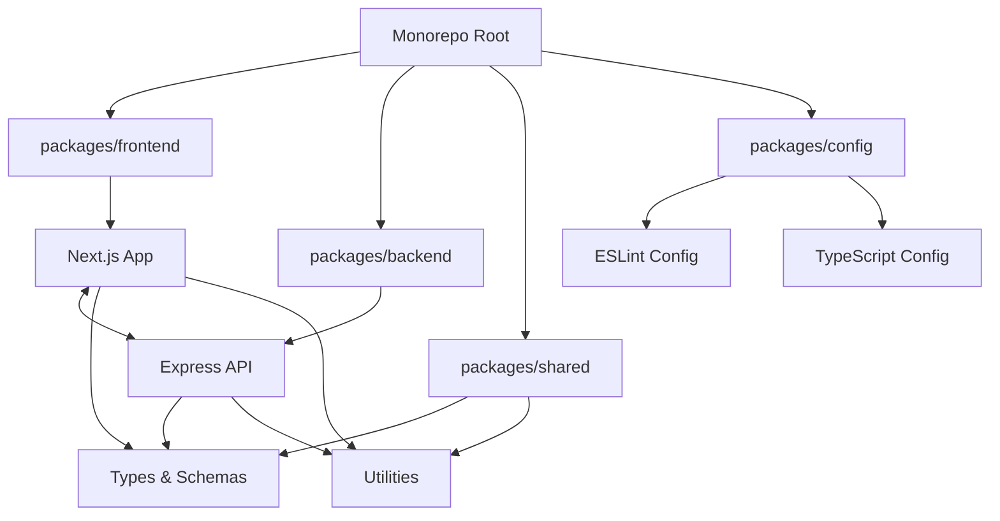
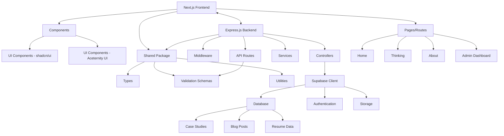

# Next.js Personal Website Plan with Express Backend (Monorepo Structure)

## 1. Project Overview

This personal website will showcase your 10+ years of experience in product management and UX strategy, featuring three main sections:

1. **Home Page**: Professional introduction highlighting expertise in aligning product vision with business needs
2. **Thinking Page**: Masonry-style layout featuring detailed case studies and blog posts
3. **About Page**: Resume-style presentation with work experience, education, skills, and contact form

The project will use a monorepo structure with:
- **Frontend**: Next.js with shadcn/ui and Aceternity UI for a responsive, animated interface
- **Backend**: Express.js server with Zod validation, connecting to Supabase as the database
- **Shared Packages**: Common types, utilities, and validation schemas

## 2. Monorepo Architecture



## 3. Technical Architecture



## 4. Monorepo Project Structure

```
personal-website/
├── package.json (root package.json)
├── turbo.json (Turborepo configuration)
├── apps/
│   ├── frontend/ (Next.js app)
│   │   ├── app/
│   │   ├── components/
│   │   ├── lib/
│   │   ├── public/
│   │   └── package.json
│   └── backend/ (Express.js app)
│       ├── src/
│       │   ├── routes/
│       │   ├── controllers/
│       │   ├── middleware/
│       │   ├── services/
│       │   └── server.js
│       └── package.json
├── packages/
│   ├── shared/ (Shared code)
│   │   ├── src/
│   │   │   ├── types/ (TypeScript types)
│   │   │   ├── schemas/ (Zod schemas)
│   │   │   └── utils/ (Shared utilities)
│   │   └── package.json
│   └── config/ (Shared configurations)
│       ├── eslint/
│       ├── tsconfig/
│       └── package.json
└── .github/ (CI/CD workflows)
```

## 5. Frontend Structure (Next.js)

```
apps/frontend/
├── app/
│   ├── page.tsx (Home)
│   ├── thinking/
│   │   └── page.tsx
│   ├── about/
│   │   └── page.tsx
│   └── admin/
│       └── page.tsx
├── components/
│   ├── ui/
│   │   ├── shadcn/ (shadcn components)
│   │   └── aceternity/ (Aceternity UI components)
│   ├── sections/ (Page sections)
│   ├── features/ (Feature components)
│   └── admin/ (Admin components)
├── lib/
│   ├── api.ts (API client for Express backend)
│   └── utils.ts
├── public/
│   └── (static assets)
└── package.json
```

## 6. Backend Structure (Express.js)

```
apps/backend/
├── src/
│   ├── server.js (Main Express setup)
│   ├── routes/
│   │   ├── api.js (API router)
│   │   ├── case-studies.js
│   │   ├── blog-posts.js
│   │   ├── profile.js
│   │   └── admin.js
│   ├── controllers/
│   │   ├── case-studies.js
│   │   ├── blog-posts.js
│   │   ├── profile.js
│   │   └── admin.js
│   ├── middleware/
│   │   ├── auth.js
│   │   ├── error-handler.js
│   │   └── validation.js
│   └── services/
│       ├── supabase.js (Supabase client)
│       ├── case-studies.js
│       ├── blog-posts.js
│       └── profile.js
└── package.json
```

## 7. Shared Package Structure

```
packages/shared/
├── src/
│   ├── types/
│   │   ├── case-study.ts
│   │   ├── blog-post.ts
│   │   ├── profile.ts
│   │   └── admin.ts
│   ├── schemas/
│   │   ├── case-study.ts (Zod schemas)
│   │   ├── blog-post.ts
│   │   ├── profile.ts
│   │   └── contact.ts
│   └── utils/
│       ├── dates.ts
│       ├── formatting.ts
│       └── validation.ts
└── package.json
```

## 8. Express API Structure

The Express backend will provide a RESTful API with the following endpoints:

### Public Endpoints

```
GET    /api/case-studies           - Get all case studies (with pagination)
GET    /api/case-studies/:slug     - Get specific case study by slug
GET    /api/blog-posts             - Get all blog posts (with pagination)
GET    /api/blog-posts/:slug       - Get specific blog post by slug
GET    /api/profile                - Get profile information
POST   /api/contact                - Submit contact form

GET    /api/tags                   - Get all tags
GET    /api/case-studies/tag/:tag  - Get case studies by tag
GET    /api/blog-posts/tag/:tag    - Get blog posts by tag
```

### Protected Admin Endpoints

```
POST   /api/auth/login             - Admin login
POST   /api/auth/logout            - Admin logout

GET    /api/admin/case-studies     - Get all case studies for admin
POST   /api/admin/case-studies     - Create new case study
PUT    /api/admin/case-studies/:id - Update case study
DELETE /api/admin/case-studies/:id - Delete case study

GET    /api/admin/blog-posts       - Get all blog posts for admin
POST   /api/admin/blog-posts       - Create new blog post
PUT    /api/admin/blog-posts/:id   - Update blog post
DELETE /api/admin/blog-posts/:id   - Delete blog post

GET    /api/admin/profile          - Get profile for admin
PUT    /api/admin/profile          - Update profile

GET    /api/admin/contact          - Get contact submissions
PUT    /api/admin/contact/:id      - Mark contact as read
DELETE /api/admin/contact/:id      - Delete contact submission
```

## 9. Shared Zod Validation Schemas

Zod schemas will be defined in the shared package and used by both frontend and backend:

```typescript
// packages/shared/src/schemas/case-study.ts
import { z } from 'zod';

export const caseStudySchema = z.object({
  title: z.string().min(3).max(100),
  slug: z.string().min(3).max(100).regex(/^[a-z0-9-]+$/),
  summary: z.string().min(10).max(500),
  featured_image_url: z.string().url().optional(),
  published: z.boolean().default(false),
  published_date: z.string().datetime().optional(),
});

export const caseStudySectionSchema = z.object({
  case_study_id: z.number(),
  section_type: z.enum([
    'challenge',
    'approach',
    'solution',
    'results',
    'learnings',
    'future_directions'
  ]),
  section_order: z.number().int().min(0),
  title: z.string().min(3).max(100),
  content: z.string().min(10),
});

// packages/shared/src/schemas/contact.ts
export const contactFormSchema = z.object({
  name: z.string().min(2).max(100),
  email: z.string().email(),
  message: z.string().min(10).max(2000),
});
```

## 10. Shared TypeScript Types

```typescript
// packages/shared/src/types/case-study.ts
export interface CaseStudy {
  id: number;
  title: string;
  slug: string;
  summary: string;
  featured_image_url?: string;
  published: boolean;
  published_date?: string;
  created_at: string;
  updated_at: string;
  sections?: CaseStudySection[];
  metrics?: CaseStudyMetric[];
  tags?: string[];
}

export interface CaseStudySection {
  id: number;
  case_study_id: number;
  section_type: 'challenge' | 'approach' | 'solution' | 'results' | 'learnings' | 'future_directions';
  section_order: number;
  title: string;
  content: string;
  created_at: string;
  updated_at: string;
}

// Similar interfaces for other entities...
```

## 11. Monorepo Development Workflow

### Setup and Installation

```bash
# Install dependencies
npm install

# Build all packages
npm run build

# Development mode
npm run dev
```

### Turborepo Configuration

```json
// turbo.json
{
  "$schema": "https://turbo.build/schema.json",
  "pipeline": {
    "build": {
      "dependsOn": ["^build"],
      "outputs": [".next/**", "dist/**"]
    },
    "dev": {
      "cache": false,
      "persistent": true
    },
    "lint": {},
    "test": {}
  }
}
```

### Root Package.json

```json
{
  "name": "personal-website",
  "version": "0.0.0",
  "private": true,
  "workspaces": [
    "apps/*",
    "packages/*"
  ],
  "scripts": {
    "build": "turbo run build",
    "dev": "turbo run dev",
    "lint": "turbo run lint",
    "test": "turbo run test",
    "format": "prettier --write \"**/*.{ts,tsx,md}\"",
    "prepare": "husky install"
  },
  "devDependencies": {
    "@commitlint/cli": "^18.4.2",
    "@commitlint/config-conventional": "^18.4.2",
    "eslint": "^8.52.0",
    "husky": "^8.0.3",
    "lint-staged": "^15.1.0",
    "prettier": "^3.0.3",
    "turbo": "^1.10.16"
  },
  "engines": {
    "node": ">=18.0.0"
  }
}
```

## 12. UI Component Strategy

The UI component strategy remains the same, using:

**shadcn/ui Components (Core Functionality)**
- Navigation menus
- Buttons and form elements
- Cards and containers
- Modals and dialogs
- Tabs and accordions
- Tables and data display
- Form inputs and validation

**Aceternity UI Components (Visual Enhancement)**
- Animated hero sections
- Floating elements and 3D cards
- Text animations and transitions
- Parallax scrolling effects
- Interactive backgrounds
- Animated counters for metrics
- Spotlight and hover effects

## 13. Supabase Database Schema

The database schema remains the same as in the original plan, with tables for:
- profiles
- work_experiences
- education
- skills
- case_studies
- case_study_sections
- case_study_metrics
- blog_posts
- tags
- case_study_tags
- blog_post_tags
- contact_submissions

## 14. Authentication Flow

The authentication flow will be handled through the Express backend:

1. Admin login through Express API endpoint
2. JWT token generation and storage in HTTP-only cookies
3. Token verification middleware for protected routes
4. Supabase RLS (Row Level Security) as an additional security layer

## 15. Implementation Plan for Monorepo

### Phase 1: Monorepo Setup (Week 1)
- Initialize monorepo structure with Turborepo
- Set up shared configuration packages
- Create frontend and backend workspaces
- Configure scripts and dependencies
- Set up ESLint, Prettier, and TypeScript configurations

### Phase 2: Shared Package Development (Week 1)
- Create shared TypeScript types
- Implement Zod validation schemas
- Develop common utilities
- Set up build process for shared packages

### Phase 3: Backend Development (Week 1-2)
- Set up Express.js server with middleware
- Implement API routes and controllers
- Create Supabase client service
- Implement authentication and authorization
- Set up error handling and logging

### Phase 4: Database and API Integration (Week 2)
- Set up Supabase project and initial schema
- Create database tables and relationships
- Implement API endpoints for all CRUD operations
- Test API endpoints
- Create seed data for development

### Phase 5: Frontend Development (Week 2-3)
- Set up Next.js with Tailwind CSS
- Install and configure shadcn/ui and Aceternity UI
- Create API client to connect to Express backend
- Build shared components and layouts
- Implement responsive design system

### Phase 6: Page Development (Week 3-4)
- Develop Home page with responsive design
- Build Thinking page with masonry layout and filtering
- Create case study detail page template
- Create About page with resume sections and animations
- Implement contact form functionality

### Phase 7: Admin Interface (Week 4)
- Create admin login page and authentication flow
- Build admin dashboard layout
- Implement content management interfaces
- Create form validation and submission handling
- Build image upload functionality

### Phase 8: Testing and Refinement (Week 4-5)
- Implement unit and integration tests
- Perform cross-browser and device testing
- Optimize performance with Lighthouse
- Address any accessibility issues
- Refine animations and interactions

### Phase 9: Deployment (Week 5)
- Set up production environments
- Configure environment variables
- Set up CI/CD pipeline
- Deploy to production
- Monitor for issues and performance

## 16. Development Environment Setup

For local development, we'll use:

1. **Frontend**: Next.js dev server on port 3000
2. **Backend**: Express server on port 5000
3. **Database**: Supabase project with connection strings in .env files

Turborepo will coordinate these processes and enable:
- Parallel execution of dev servers
- Caching for faster builds
- Dependency graph management

## 17. Deployment Strategy

The monorepo deployment strategy will involve:

1. **Frontend**: Deploy to Vercel
2. **Backend**: Deploy to a Node.js hosting service (Render, Railway, or similar)
3. **Database**: Supabase cloud hosting
4. **CI/CD**: GitHub Actions workflow to build, test, and deploy both apps

## 18. Additional Considerations

1. **Monorepo Benefits**:
   - Shared code between frontend and backend
   - Consistent versioning across packages
   - Simplified dependency management
   - Atomic changes across packages
   - Coordinated testing and deployment

2. **Monorepo Challenges to Address**:
   - Build and deployment complexity
   - Potential repository size growth
   - Managing package interdependencies
   - CI/CD pipeline configuration

3. **Performance Optimizations**:
   - Implement turborepo's caching for faster builds
   - Use workspace dependencies efficiently
   - Configure appropriate ignore patterns
   - Optimize CI/CD workflow for monorepo structure