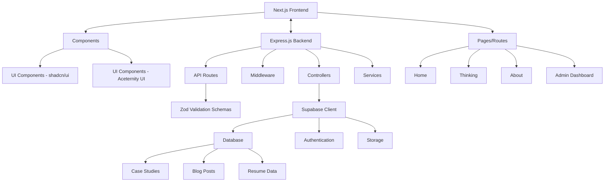

# Revised Next.js Personal Website Plan with Express Backend

## 1. Project Overview

This personal website will showcase your 10+ years of experience in product management and UX strategy, featuring three main sections:

1. **Home Page**: Professional introduction highlighting expertise in aligning product vision with business needs
2. **Thinking Page**: Masonry-style layout featuring detailed case studies and blog posts
3. **About Page**: Resume-style presentation with work experience, education, skills, and contact form

The project will now use a two-part architecture:
- **Frontend**: Next.js with shadcn/ui and Aceternity UI for a responsive, animated interface
- **Backend**: Express.js server with Zod validation, connecting to Supabase as the database

## 2. Revised Technical Architecture



## 3. Project Structure

### Frontend (Next.js)

```
frontend/
├── app/
│   ├── page.tsx (Home)
│   ├── thinking/
│   │   └── page.tsx
│   ├── about/
│   │   └── page.tsx
│   └── admin/
│       └── page.tsx
├── components/
│   ├── ui/
│   │   ├── shadcn/ (shadcn components)
│   │   └── aceternity/ (Aceternity UI components)
│   ├── sections/ (Page sections)
│   ├── features/ (Feature components)
│   └── admin/ (Admin components)
├── lib/
│   ├── api.ts (API client for Express backend)
│   ├── utils.ts
│   └── types.ts
├── hooks/
│   └── (custom hooks)
└── public/
    └── (static assets)
```

### Backend (Express.js)

```
backend/
├── server.js (Main Express setup)
├── routes/
│   ├── api.js (API router)
│   ├── case-studies.js
│   ├── blog-posts.js
│   ├── profile.js
│   └── admin.js
├── controllers/
│   ├── case-studies.js
│   ├── blog-posts.js
│   ├── profile.js
│   └── admin.js
├── middleware/
│   ├── auth.js
│   ├── error-handler.js
│   └── validation.js
├── services/
│   ├── supabase.js (Supabase client)
│   ├── case-studies.js
│   ├── blog-posts.js
│   └── profile.js
└── schemas/
    ├── case-studies.js (Zod schemas)
    ├── blog-posts.js
    ├── profile.js
    └── admin.js
```

## 4. Express API Structure

The Express backend will provide a RESTful API with the following endpoints:

### Public Endpoints

```
GET    /api/case-studies           - Get all case studies (with pagination)
GET    /api/case-studies/:slug     - Get specific case study by slug
GET    /api/blog-posts             - Get all blog posts (with pagination)
GET    /api/blog-posts/:slug       - Get specific blog post by slug
GET    /api/profile                - Get profile information
POST   /api/contact                - Submit contact form

GET    /api/tags                   - Get all tags
GET    /api/case-studies/tag/:tag  - Get case studies by tag
GET    /api/blog-posts/tag/:tag    - Get blog posts by tag
```

### Protected Admin Endpoints

```
POST   /api/auth/login             - Admin login
POST   /api/auth/logout            - Admin logout

GET    /api/admin/case-studies     - Get all case studies for admin
POST   /api/admin/case-studies     - Create new case study
PUT    /api/admin/case-studies/:id - Update case study
DELETE /api/admin/case-studies/:id - Delete case study

GET    /api/admin/blog-posts       - Get all blog posts for admin
POST   /api/admin/blog-posts       - Create new blog post
PUT    /api/admin/blog-posts/:id   - Update blog post
DELETE /api/admin/blog-posts/:id   - Delete blog post

GET    /api/admin/profile          - Get profile for admin
PUT    /api/admin/profile          - Update profile

GET    /api/admin/contact          - Get contact submissions
PUT    /api/admin/contact/:id      - Mark contact as read
DELETE /api/admin/contact/:id      - Delete contact submission
```

## 5. Zod Validation Schemas

Zod will be used to validate all incoming requests to the API. Here are examples of key validation schemas:

### Case Study Schema

```typescript
import { z } from 'zod';

export const caseStudySchema = z.object({
  title: z.string().min(3).max(100),
  slug: z.string().min(3).max(100).regex(/^[a-z0-9-]+$/),
  summary: z.string().min(10).max(500),
  featured_image_url: z.string().url().optional(),
  published: z.boolean().default(false),
  published_date: z.string().datetime().optional(),
});

export const caseStudySectionSchema = z.object({
  case_study_id: z.number(),
  section_type: z.enum([
    'challenge',
    'approach',
    'solution',
    'results',
    'learnings',
    'future_directions'
  ]),
  section_order: z.number().int().min(0),
  title: z.string().min(3).max(100),
  content: z.string().min(10),
});

export const caseStudyMetricSchema = z.object({
  case_study_id: z.number(),
  section_type: z.enum(['business_impact', 'user_impact', 'technical_achievements']),
  label: z.string().min(3).max(100),
  value: z.string().min(1).max(50),
});
```

### Contact Form Schema

```typescript
import { z } from 'zod';

export const contactFormSchema = z.object({
  name: z.string().min(2).max(100),
  email: z.string().email(),
  message: z.string().min(10).max(2000),
});
```

## 6. UI Component Strategy

The UI component strategy remains the same, using:

**shadcn/ui Components (Core Functionality)**
- Navigation menus
- Buttons and form elements
- Cards and containers
- Modals and dialogs
- Tabs and accordions
- Tables and data display
- Form inputs and validation

**Aceternity UI Components (Visual Enhancement)**
- Animated hero sections
- Floating elements and 3D cards
- Text animations and transitions
- Parallax scrolling effects
- Interactive backgrounds
- Animated counters for metrics
- Spotlight and hover effects

## 7. Supabase Database Schema

The database schema remains the same as in the original plan, with tables for:
- profiles
- work_experiences
- education
- skills
- case_studies
- case_study_sections
- case_study_metrics
- blog_posts
- tags
- case_study_tags
- blog_post_tags
- contact_submissions

## 8. Authentication Flow

The authentication flow will now be handled through the Express backend:

1. Admin login through Express API endpoint
2. JWT token generation and storage in HTTP-only cookies
3. Token verification middleware for protected routes
4. Supabase RLS (Row Level Security) as an additional security layer

## 9. Implementation Plan (Revised)

### Phase 1: Project Setup (Week 1)
- Initialize Next.js frontend project with TypeScript
- Initialize Express.js backend project
- Set up project structure for both frontend and backend
- Install necessary dependencies for both projects
- Configure ESLint, Prettier, and TypeScript for both projects

### Phase 2: Backend Development (Week 1-2)
- Set up Express.js server with middleware
- Create Zod validation schemas for all data models
- Implement Supabase client service
- Create API routes and controllers
- Implement authentication and authorization
- Set up error handling and logging

### Phase 3: Database and API Integration (Week 2)
- Set up Supabase project and initial schema
- Create database tables and relationships
- Implement API endpoints for all CRUD operations
- Test API endpoints with Postman or similar tool
- Create seed data for development

### Phase 4: Frontend Development (Week 2-3)
- Set up Next.js with Tailwind CSS
- Install and configure shadcn/ui and Aceternity UI
- Create API client to connect to Express backend
- Build shared components and layouts
- Implement responsive design system

### Phase 5: Page Development (Week 3-4)
- Develop Home page with responsive design
- Build Thinking page with masonry layout and filtering
- Create case study detail page template
- Create About page with resume sections and animations
- Implement contact form functionality

### Phase 6: Admin Interface (Week 4)
- Create admin login page and authentication flow
- Build admin dashboard layout
- Implement content management interfaces
- Create form validation and submission handling
- Build image upload functionality

### Phase 7: Testing and Refinement (Week 4-5)
- Implement unit and integration tests
- Perform cross-browser and device testing
- Optimize performance with Lighthouse
- Address any accessibility issues
- Refine animations and interactions

### Phase 8: Deployment (Week 5)
- Set up production environments for frontend and backend
- Configure environment variables
- Set up CI/CD pipeline
- Deploy to production
- Monitor for issues and performance

## 10. Development Environment Setup

For local development, we'll use:

1. **Frontend**: Next.js dev server on port 3000
2. **Backend**: Express server on port 5000
3. **Database**: Supabase project with connection strings in .env files

## 11. Deployment Strategy

The deployment strategy will involve:

1. **Frontend**: Deploy to Vercel
2. **Backend**: Deploy to a Node.js hosting service (Render, Railway, or similar)
3. **Database**: Supabase cloud hosting

## 12. Additional Considerations

1. **API Documentation**: Implement Swagger/OpenAPI documentation for the Express API
2. **Rate Limiting**: Add rate limiting middleware to protect against abuse
3. **CORS Configuration**: Properly configure CORS for security
4. **Error Handling**: Implement consistent error responses across the API
5. **Logging**: Set up structured logging for debugging and monitoring
6. **Responsive Design**: Maintain the responsive design approach for all public-facing content
7. **API Caching**: Implement caching strategies for frequently accessed data